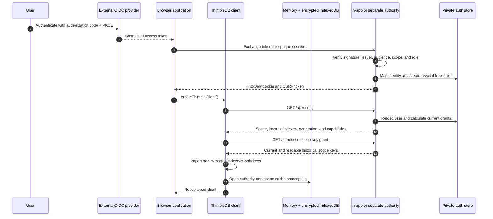
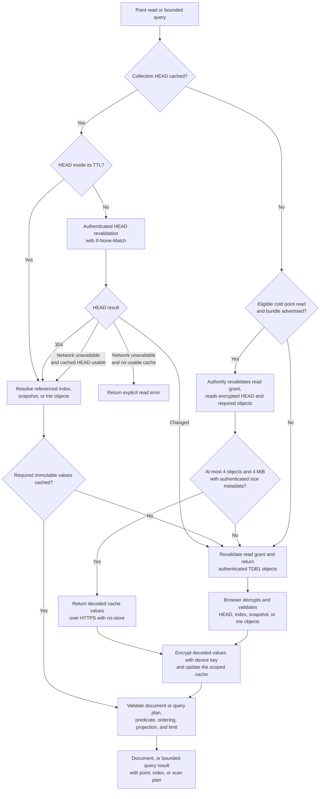
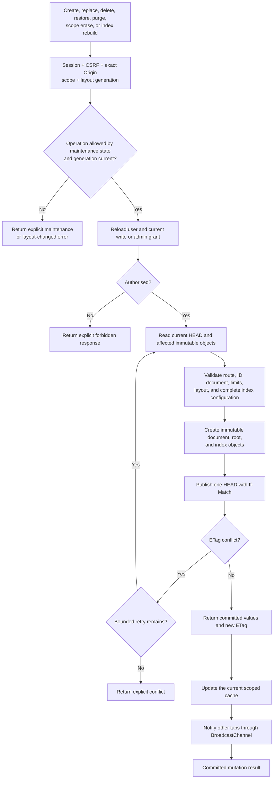
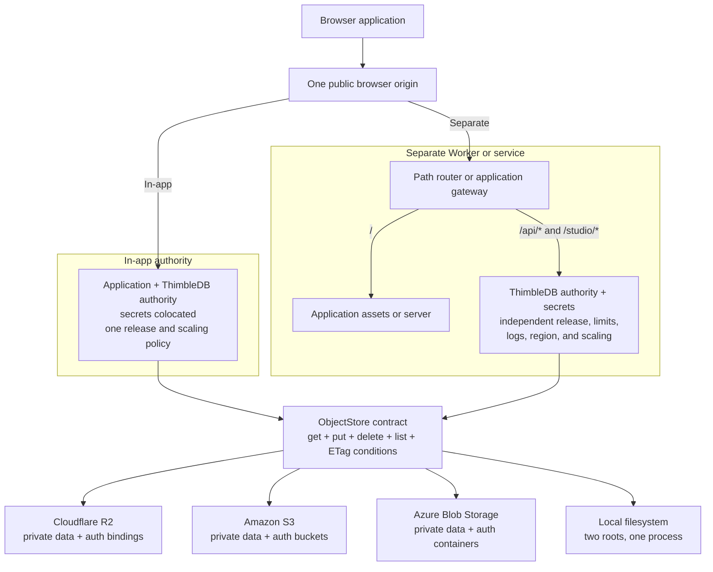

<h1>
  
  ThimbleDB
</h1>

ThimbleDB is a Cloudflare-first database for small, read-heavy web
applications. Browsers read through an authenticated authority and retain
scope-separated data in memory and encrypted IndexedDB caches. The default
read path returns encrypted immutable objects; deployments can explicitly
enable bounded decoded read bundles for eligible cold point reads. Writes and
key grants use the same small authority.

Cloudflare Workers and R2 are the reference deployment. Azure Blob Storage,
Amazon S3, and a local filesystem adapter implement the same provider-neutral
ObjectStore contract.

Licensed under the [Apache License 2.0](LICENSE).

## Architecture

### Identity, session, and client bootstrap



1. External OIDC owns credentials, MFA, recovery, and token issuance. Service
   principals use short-lived application tokens through the same exchange.
2. The authority maps the external identity to a stable internal principal,
   stores only an opaque session digest, and recalculates grants on requests.
3. The browser imports authorised scope keys as non-extractable, memory-only
   CryptoKeys. Persistent cache values use a separate device key.

### Read flow



1. Warm reads stay in the authority-and-scope cache while the mutable HEAD is
   fresh. Expired HEADs use conditional revalidation, and a usable cache can
   remain available during a network failure.
2. Cold point reads can use one
   bounded decoded bundle when explicitly enabled; every ineligible or failed
   bundle falls back to authenticated TDB1 object reads.
3. Queries remain bounded and report whether they used a point, declared
   index, covering projection, or collection scan plan.

### Mutation and cache-synchronisation flow



1. The authority validates every mutation, creates immutable document and
   index objects, and publishes their references through one conditional HEAD.
2. Successful writes update the current cache and notify other tabs. Logout
   revokes the session and clears the affected browser cache namespace.

### Deployment, scaling, and storage flow



In-app deployment has the lowest operational floor and scales the application
and authority together. A separate Worker or service isolates credentials,
deployments, failures, observability, regional placement, and runtime scaling.
It does not remove per-collection conditional-write contention or change the
browser API.

The stored object and encryption protocol stays the same across providers.
Only bindings, credentials, and deployment primitives differ. The local
filesystem adapter remains single-process; use shared cloud object storage
before horizontally scaling a Node authority.

## Features

- framework-free browser client
- memory and encrypted IndexedDB caches
- brokered immutable object reads
- ETag HEAD revalidation and offline fallback
- access-scope-separated collection trees
- adaptive gzip before AES-256-GCM
- object-key-bound authenticated encryption
- HMAC-derived private node addresses
- authority-only conditional writes with route and document ID validation
- Microsoft Entra and generic OIDC identity mapping
- opaque revocable sessions tied to stable internal user IDs
- dual-proof identity linking and provider-role administration
- per-user and per-tenant scope grants
- retained deletion, restoration, and quiescent physical collection
- immutable snapshot and content-addressed trie collection layouts
- typed collections, bounded predicates, and declared secondary indexes
- bounded cold point-read bundles with object-path fallback
- explicit covering index fields and typed projections
- versioned logical archives and explicit migration adapters
- local application scaffolding and diagnostics
- optional package-owned Studio management frontend
- evidence-based layout recommendations and explicit migration
- write responses that update all open browser tabs
- Cloudflare Worker and native R2 binding
- local, Azure Blob, and S3 Node adapters
- historical key reads and an idempotent key-migration command
- Chromium, Firefox, and WebKit recovery tests
- typed package exports for the browser/core and auth APIs
- reusable Node and Cloudflare authority endpoint exports
- Docker, Wrangler, Bicep, and CloudFormation deployment paths

The reference browser build is about 68.3 KB uncompressed and 18.7 KB gzip.
It ships no database runtime or WASM module.

## Quick start

Create a local web app:

```powershell
npx thimbledb@latest create my-notes-app
cd my-notes-app
npm run dev
```

Or start from a maintained repository template:

- [Node starter](https://github.com/Jason-Doyle/thimbledb-node-starter)
- [Cloudflare starter](https://github.com/Jason-Doyle/thimbledb-cloudflare-starter)

Or install the package directly:

```powershell
npm install thimbledb
```

Generate the recommended Microsoft Entra delegated scope and application
roles:

```powershell
npx thimbledb generate-entra-roles --out entra-authorization.json
```

Enable the package-owned management frontend on a Node authority:

```ts
await startNodeAuthority({
  studio: true,
  studioOrigin: "https://database.example.com",
});
```

Then open `/studio/`. See [ThimbleDB Studio](docs/STUDIO.md).

The base install includes the browser/core APIs, authentication, Cloudflare
authority, local provider, and Node authority without cloud storage SDKs.
Install only the Node storage adapter your deployment uses:

```powershell
# Azure Blob
npm install @azure/storage-blob

# Amazon S3 or R2 through the S3 API
npm install @aws-sdk/client-s3
```

Use the browser/core API from `thimbledb`, external identity primitives from
`thimbledb/auth`, and the complete endpoint authority from either
`thimbledb/authority/node` or `thimbledb/authority/cloudflare`. Consumers
supply their own domain, storage, OIDC application, and secrets.

The authority can run in-app with the application or as a separate Worker,
container, function, or Node service behind the same public browser origin.
In-app deployment minimises operations. A separate authority isolates secrets,
releases, failures, and scaling. See
[In-app and separate authority deployment](docs/AUTHORITY-DEPLOYMENT.md).

After the authority session exists:

```ts
import { createThimbleClient } from "thimbledb";

const db = await createThimbleClient();
const notes = db.collection<Note>("notes");
```

Follow the [full quickstart](docs/QUICKSTART.md) for Cloudflare, Node, and
browser setup. [Implementation prompts](docs/IMPLEMENTATION-PROMPTS.md) provide
copy-paste instructions for coding tools.

Use [Should you use ThimbleDB for a vibe-coded app?](docs/VIBE-CODED-APPS.md)
for an exact fit check before integration. The
[database comparisons](docs/COMPARISONS.md) describe when D1, SQLite,
Firestore, lowdb, or direct object storage is the better choice.

See [Use cases](docs/USE-CASES.md) for workload fit checks and complete guides
for personal workspaces, tenant operations, field use, catalogues, journals,
and structured AI application context.

To run a source checkout:

```powershell
npm install
npm run dev
```

Open `http://127.0.0.1:5173`.

Configure Entra or a generic OIDC provider before signing in. The browser
harness accepts an API access token and exchanges it for a ThimbleDB session.
See [Authentication](docs/AUTHENTICATION.md).

The local provider is intended for development and one Node process. It is not
a multi-process coordination backend.

For the browser harness, sample store, and benchmark commands, see
[Evaluation harness](docs/EVALUATION.md).

## Cloudflare reference deployment

The reference deployment uses:

- one Worker for API routes, static assets, scope authorisation, and key grants
- one R2 binding for writes and maintenance
- one authenticated Worker broker for encrypted browser reads
- the application's Entra or OIDC identity layer

Start with [Deploy to Cloudflare](docs/DEPLOYMENT-CLOUDFLARE.md).

## Performance characteristics

Published evidence includes a 3,808-operation current-layout run from seven
Azure regions against a temporary Cloudflare Worker and R2 bucket:

- `evidence/r2-current-layout-multiregion-2026-09-25.json`
- `evidence/r2-current-layout-summary-2026-09-25.csv`

The measurements show:

- snapshots had lower pooled cold point-read p95 than tries at 128, 5,000,
  and 25,000 documents
- trie point reads transferred far fewer bytes but required four sequential
  requests without a bundle
- Trie bundle improved medium and large trie point-read p95, but did not make
  Trie faster than Snapshot overall
- covering indexes kept equality and range queries to two network reads
- large uncovered snapshot queries and trie scans exposed clear rejection
  boundaries
- all single-writer operations succeeded, while simultaneous seven-region
  writes produced failures and very high tail latency for both layouts
- all 14 regional runs rejected a gzip envelope that expanded beyond the
  16 MiB decoded-object limit
- cold reads and large indexed writes remain too slow for latency-sensitive
  request paths; production fit depends on warm browser cache hits dominating
  user activity

The earlier authenticated Chromium evidence remains checked in:

- `evidence/r2-browser-multiregion-trie-2026-09-24.json`
- `evidence/r2-browser-multiregion-snapshot-2026-09-24.json`

These results do not establish better cost or latency than D1, Durable Objects,
Turso, Firestore, or another managed database. See
[Benchmarks](docs/BENCHMARKS.md) for methods, raw artifacts, limitations, and
layout decision thresholds.

## Documentation

| Document | Purpose |
| --- | --- |
| [Quickstart](docs/QUICKSTART.md) | Package, authority, browser client, and verification setup |
| [Configuration reference](docs/CONFIGURATION.md) | Authority options, environment variables, provider settings, defaults, and template coverage |
| [Implementation prompts](docs/IMPLEMENTATION-PROMPTS.md) | Copy-paste integration, deployment, migration, and review prompts |
| [npm publishing](docs/NPM-PUBLISHING.md) | OIDC trusted publisher setup and release process |
| [Use cases](docs/USE-CASES.md) | Fit criteria and application-specific guides |
| [Architecture](docs/ARCHITECTURE.md) | Components, data flow, and scope model |
| [In-app and separate authority deployment](docs/AUTHORITY-DEPLOYMENT.md) | Topologies, scaling opportunities, trust boundaries, and decision criteria |
| [System diagrams](docs/DIAGRAMS.md) | Trust, deployment, read, write, deletion, key, migration, Studio, and provider flows |
| [Storage providers](docs/STORAGE-PROVIDERS.md) | Provider abstraction and conformance requirements |
| [Security](docs/SECURITY.md) | Threat model, encryption, keys, and revocation |
| [Authentication](docs/AUTHENTICATION.md) | External identity mapping, sessions, and scope grants |
| [Deletion and retention](docs/DELETION-RETENTION.md) | Tombstones, restoration, scope erasure, and physical collection |
| [Adaptive layouts](docs/ADAPTIVE-LAYOUTS.md) | Snapshot/trie recommendations and explicit migration |
| [Protocol](docs/PROTOCOL.md) | Binary envelope and object layout |
| [Versioning](docs/VERSIONING.md) | Package, protocol, key, and release compatibility rules |
| [Public API](docs/PUBLIC-API.md) | Stable package exports and authority integration |
| [Evaluation harness](docs/EVALUATION.md) | Browser harness, sample application, and benchmark usage |
| [Benchmarks](docs/BENCHMARKS.md) | Multi-region R2 methodology, tables, graphs, raw evidence, and limitations |
| [Tradeoffs](docs/TRADEOFFS.md) | Proven, expected, and unsuitable use cases |
| [Cloudflare deployment](docs/DEPLOYMENT-CLOUDFLARE.md) | Worker and R2 reference deployment |
| [Azure deployment](docs/DEPLOYMENT-AZURE.md) | Container Apps and Blob Storage |
| [AWS deployment](docs/DEPLOYMENT-AWS.md) | Lambda container and private S3 buckets |
| [Operations](docs/OPERATIONS.md) | Keys, backup, metrics, incidents, and cleanup |
| [Website privacy](docs/WEBSITE-PRIVACY.md) | Static-site data handling and Cloudflare Web Analytics disclosure |

## When to use ThimbleDB

ThimbleDB is suited to small per-user or per-tenant datasets, catalogues,
configuration, internal tools, and applications whose hot working set fits in
browser storage.

Choose another database for relational transactions, high-frequency shared
counters, large cross-tenant queries, or strict immediate revocation. Warm
cached reads are fast, but cold object reads and external session creation can
take seconds from distant regions. Design the first-load experience with those
limits in mind.
