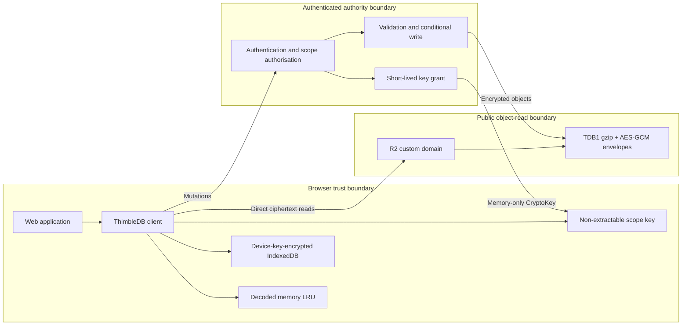
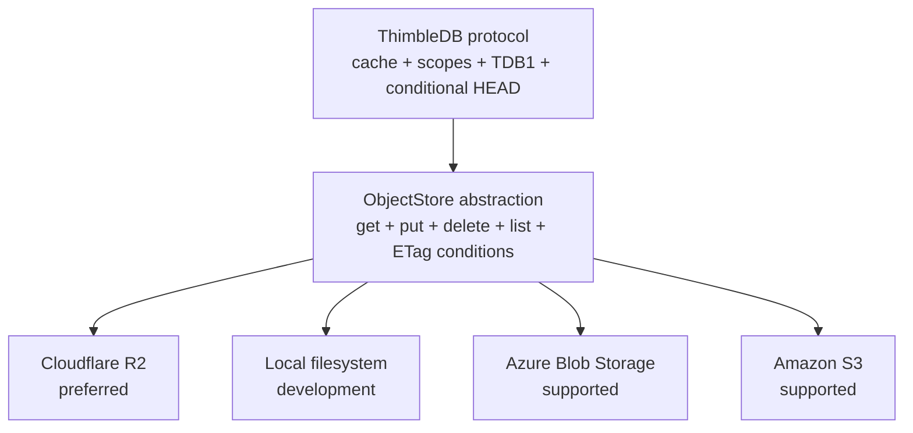

# ThimbleDB

ThimbleDB is an experimental Cloudflare-first database for small web
applications. Browsers read encrypted immutable objects directly from storage
through memory and IndexedDB caches. Authenticated writes and key grants go
through a small authority.

Cloudflare Workers and R2 are the reference deployment. Azure Blob Storage,
Amazon S3, and a local filesystem adapter implement the same provider-neutral
ObjectStore contract.

## Architecture





The stored object and encryption protocol stays the same across providers.
Only bindings, credentials, and browser read authorisation differ.

## Current capabilities

- framework-free browser client
- memory and encrypted IndexedDB caches
- direct immutable object reads
- ETag HEAD revalidation and offline fallback
- access-scope-separated collection trees
- adaptive gzip before AES-256-GCM
- object-key-bound authenticated encryption
- HMAC-derived private node addresses
- server-only validated writes
- write responses that update all open browser tabs
- Cloudflare Worker and native R2 binding
- local, Azure Blob, and S3 Node adapters
- Docker, Wrangler, Bicep, and CloudFormation deployment paths

The browser bundle is about 19.5 KB uncompressed and 6.7 KB gzip. No database
runtime or WASM module is shipped.

## Quick start

```powershell
npm install
npm run dev
```

Open `http://127.0.0.1:5173`.

The local provider is intended for development and one Node process. It is not
a multi-process coordination backend.

For the evaluation harness, sample store, and benchmark commands, see
[Proof of concept](docs/POC.md).

## Cloudflare reference deployment

The reference deployment uses:

- one Worker for API routes, static assets, scope authorisation, and key grants
- one R2 binding for writes and maintenance
- one R2 custom domain for direct encrypted browser reads
- Cloudflare Access or the application's identity layer in front of the Worker

Start with [Deploy to Cloudflare](docs/DEPLOYMENT-CLOUDFLARE.md).

## Evidence status

The repository includes raw Azure Standard Blob Storage measurements at
`evidence/azure-standard-small.json`.

Measured so far:

- full-content caching dominates repeated-read latency
- location-only caching greatly reduces trie point-read bytes
- a single mutable collection root performs poorly under bursty concurrent
  writes
- monolithic compressed snapshots remain credible for small, rarely changed
  collections

These results do not yet prove better cost or latency than D1, Durable Objects,
Turso, Firestore, or another managed database. The remaining evidence plan and
stop/go thresholds are documented in [Benchmarks](docs/BENCHMARKS.md).

## Documentation

| Document | Purpose |
| --- | --- |
| [Architecture](docs/ARCHITECTURE.md) | Components, data flow, and scope model |
| [System diagrams](docs/DIAGRAMS.md) | Trust boundaries, sequences, keys, and providers |
| [Storage providers](docs/STORAGE-PROVIDERS.md) | Provider abstraction and conformance requirements |
| [Security](docs/SECURITY.md) | Threat model, encryption, keys, and revocation |
| [Protocol](docs/PROTOCOL.md) | Binary envelope and object layout |
| [Proof of concept](docs/POC.md) | Browser harness, sample application, and benchmark usage |
| [Benchmarks](docs/BENCHMARKS.md) | Reproduction, measured results, and evidence gaps |
| [Tradeoffs](docs/TRADEOFFS.md) | Proven, expected, and unsuitable use cases |
| [Cloudflare deployment](docs/DEPLOYMENT-CLOUDFLARE.md) | Worker and R2 reference deployment |
| [Azure deployment](docs/DEPLOYMENT-AZURE.md) | Container Apps and Blob Storage |
| [AWS deployment](docs/DEPLOYMENT-AWS.md) | Lambda container, S3, and CloudFront |
| [Operations](docs/OPERATIONS.md) | Keys, backup, metrics, incidents, and cleanup |
| [Release strategy](docs/RELEASE-STRATEGY.md) | npm packages and other distribution vectors |

## Project status

ThimbleDB is private research, not a production database. It still needs:

- integration with a real application identity system
- multi-version key rotation and migration
- safe garbage collection with concurrent stale writers
- adaptive snapshot versus trie selection
- R2 browser benchmarks from multiple regions
- browser compatibility and recovery testing

The current goal is to prove a measurable benefit for small Cloudflare-hosted
applications before defining a public release.
