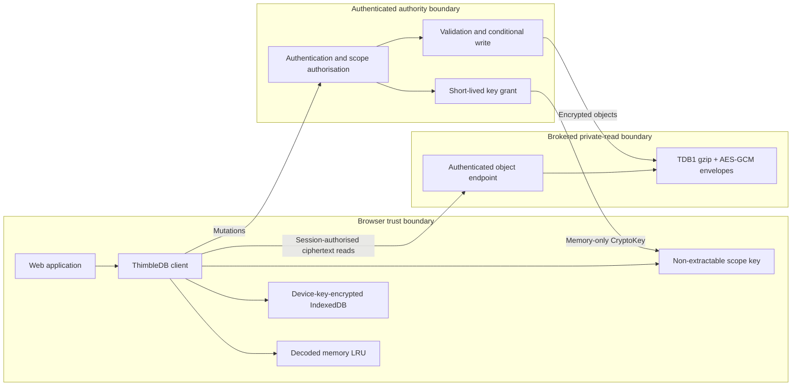
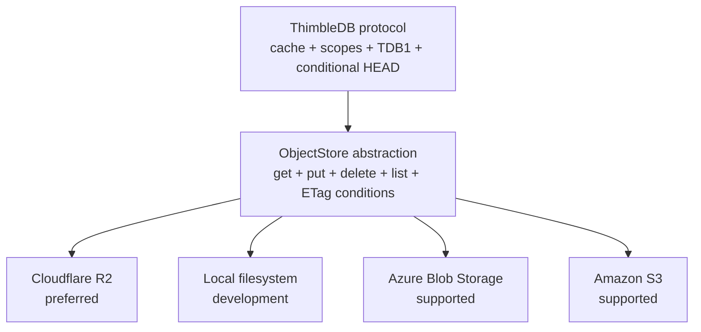

<h1>
  
  ThimbleDB
</h1>

ThimbleDB is a Cloudflare-first database for small, read-heavy web
applications. Browsers read encrypted immutable objects through an
authenticated storage broker and retain them in memory and IndexedDB caches.
Writes and key grants use the same small authority.

Cloudflare Workers and R2 are the reference deployment. Azure Blob Storage,
Amazon S3, and a local filesystem adapter implement the same provider-neutral
ObjectStore contract.

Licensed under the [Apache License 2.0](LICENSE).

## Architecture





The stored object and encryption protocol stays the same across providers.
Only bindings, credentials, and browser read authorisation differ.

## Features

- framework-free browser client
- memory and encrypted IndexedDB caches
- brokered immutable object reads
- ETag HEAD revalidation and offline fallback
- access-scope-separated collection trees
- adaptive gzip before AES-256-GCM
- object-key-bound authenticated encryption
- HMAC-derived private node addresses
- authority-only conditional writes with route and document ID validation
- Microsoft Entra and generic OIDC identity mapping
- opaque revocable sessions tied to stable internal user IDs
- dual-proof identity linking and provider-role administration
- per-user and per-tenant scope grants
- retained deletion, restoration, and quiescent physical collection
- immutable snapshot and content-addressed trie collection layouts
- evidence-based layout recommendations and explicit migration
- write responses that update all open browser tabs
- Cloudflare Worker and native R2 binding
- local, Azure Blob, and S3 Node adapters
- historical key reads and an idempotent key-migration command
- Chromium, Firefox, and WebKit recovery tests
- typed package exports for the browser/core and auth APIs
- reusable Node and Cloudflare authority endpoint exports
- Docker, Wrangler, Bicep, and CloudFormation deployment paths

The browser bundle is about 35.2 KB uncompressed and 10.1 KB gzip. It ships no
database runtime or WASM module.

## Quick start

Install the package:

```powershell
npm install thimbledb
```

Use the browser/core API from `thimbledb`, external identity primitives from
`thimbledb/auth`, and the complete endpoint authority from either
`thimbledb/authority/node` or `thimbledb/authority/cloudflare`. There is no
dependency on `thimbledb.com`; consumers supply their own domain, storage, OIDC
application, and secrets.

Follow the [full quickstart](docs/QUICKSTART.md) for Cloudflare, Node, and
browser setup. [Implementation prompts](docs/IMPLEMENTATION-PROMPTS.md) provide
copy-paste instructions for coding tools.

See [Use cases](docs/USE-CASES.md) for workload fit checks and complete guides
for personal workspaces, tenant operations, field use, catalogues, journals,
and structured AI application context.

To run a source checkout:

```powershell
npm install
npm run dev
```

Open `http://127.0.0.1:5173`.

Configure Entra or a generic OIDC provider before signing in. The browser
harness accepts an API access token and exchanges it for a ThimbleDB session.
See [Authentication](docs/AUTHENTICATION.md).

The local provider is intended for development and one Node process. It is not
a multi-process coordination backend.

For the browser harness, sample store, and benchmark commands, see
[Evaluation harness](docs/EVALUATION.md).

## Cloudflare reference deployment

The reference deployment uses:

- one Worker for API routes, static assets, scope authorisation, and key grants
- one R2 binding for writes and maintenance
- one authenticated Worker broker for encrypted browser reads
- the application's Entra or OIDC identity layer

Start with [Deploy to Cloudflare](docs/DEPLOYMENT-CLOUDFLARE.md).

## Performance characteristics

Published evidence includes live multi-region R2 browser results against
`db.thimbledb.com`:

- `evidence/r2-browser-multiregion-trie-2026-09-24.json`
- `evidence/r2-browser-multiregion-snapshot-2026-09-24.json`

The measurements show:

- full-content caching dominates repeated-read latency
- location-only caching greatly reduces trie point-read bytes
- a single mutable collection root performs poorly under bursty concurrent
  writes
- monolithic compressed snapshots remain credible for small, rarely changed
  collections
- moving the 128-document product catalogue from trie to snapshot reduced
  measured cold reads by 29-53 percent across three Azure regions
- a 10-second HEAD TTL reduced warm snapshot p95 to 1.6-8.3 ms in those runs
- cold reads and external session creation still miss the original latency
  targets and remain documented limitations

These results do not establish better cost or latency than D1, Durable Objects,
Turso, Firestore, or another managed database. See
[Benchmarks](docs/BENCHMARKS.md) for methods, raw artifacts, limitations, and
layout decision thresholds.

## Documentation

| Document | Purpose |
| --- | --- |
| [Quickstart](docs/QUICKSTART.md) | Package, authority, browser client, and verification setup |
| [Implementation prompts](docs/IMPLEMENTATION-PROMPTS.md) | Copy-paste integration, deployment, migration, and review prompts |
| [Use cases](docs/USE-CASES.md) | Fit criteria and application-specific guides |
| [Architecture](docs/ARCHITECTURE.md) | Components, data flow, and scope model |
| [System diagrams](docs/DIAGRAMS.md) | Trust boundaries, sequences, keys, and providers |
| [Storage providers](docs/STORAGE-PROVIDERS.md) | Provider abstraction and conformance requirements |
| [Security](docs/SECURITY.md) | Threat model, encryption, keys, and revocation |
| [Authentication](docs/AUTHENTICATION.md) | External identity mapping, sessions, and scope grants |
| [Deletion and retention](docs/DELETION-RETENTION.md) | Tombstones, restoration, scope erasure, and physical collection |
| [Adaptive layouts](docs/ADAPTIVE-LAYOUTS.md) | Snapshot/trie recommendations and explicit migration |
| [Protocol](docs/PROTOCOL.md) | Binary envelope and object layout |
| [Versioning](docs/VERSIONING.md) | Package, protocol, key, and v1 compatibility rules |
| [Public API](docs/PUBLIC-API.md) | Stable package exports and authority integration |
| [Evaluation harness](docs/EVALUATION.md) | Browser harness, sample application, and benchmark usage |
| [Benchmarks](docs/BENCHMARKS.md) | R2 browser methodology, results, and limitations |
| [Tradeoffs](docs/TRADEOFFS.md) | Proven, expected, and unsuitable use cases |
| [Cloudflare deployment](docs/DEPLOYMENT-CLOUDFLARE.md) | Worker and R2 reference deployment |
| [Azure deployment](docs/DEPLOYMENT-AZURE.md) | Container Apps and Blob Storage |
| [AWS deployment](docs/DEPLOYMENT-AWS.md) | Lambda container and private S3 buckets |
| [Operations](docs/OPERATIONS.md) | Keys, backup, metrics, incidents, and cleanup |

## When to use ThimbleDB

ThimbleDB is suited to small per-user or per-tenant datasets, catalogues,
configuration, internal tools, and applications whose hot working set fits in
browser storage.

Choose another database for relational transactions, high-frequency shared
counters, large cross-tenant queries, or strict immediate revocation. Warm
cached reads are fast, but cold object reads and external session creation can
take seconds from distant regions. Design the first-load experience with those
limits in mind.
