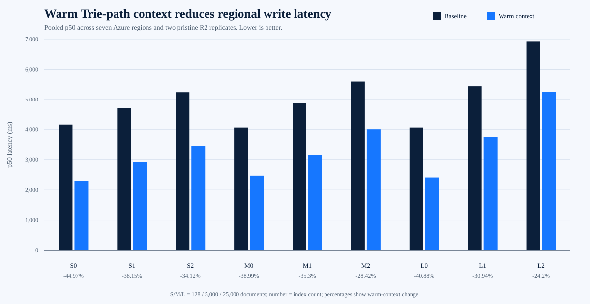

# Client-assisted Trie write experiment

Date: 29 September 2026

Branch: `experiment/client-assisted-trie-writes`

Source and final harness commit:

```text
d0084ebd81e838cf6501c6ccdaf26d57b20764a3
```

## Decision

The warm Trie-path context is promising, but it is not ready to port to
`main`.

When the signed context was already available, pooled regional p50 improved
by 24.20 to 44.97 percent and p95 improved by 14.80 to 38.37 percent. The
context removed the mutable HEAD read and the three dependent Trie-node
reads. All 1,008 writes succeeded, no assisted write fell back, and all 126
post-run protocol comparisons passed.

The predeclared acceptance gate still failed. The 25,000-document,
two-index case improved p50 by 24.20 percent rather than the required 25
percent. Regional results for that case ranged from 14.70 to 27.25 percent,
so the threshold was not missed only because of one pooled outlier.

The dedicated-context-fetch result is the larger product constraint. Fetching
context immediately before a write removed the improvement: pooled combined
p50 ranged from 4.02 percent lower to 2.52 percent higher than baseline. The
feature is useful only when an earlier application read has naturally cached
a still-valid signed HEAD and Trie path.

The full tree-plus-index context is rejected. At 25,000 documents with two
indexes it produced a 6.46 MiB request, spent 1.56 seconds verifying decoded
index pages locally, and regressed local p50 by 331.57 percent.

The useful conclusion is:

> Authority-signed warm Trie paths can remove four remote reads and materially
> reduce warm write latency, but a separate context fetch provides no useful
> gain and index pages are too large to send back to the authority.

Do not promote the current prototype. A production follow-up would first need
an actual browser integration that measures how often valid context already
exists after normal reads.

## Security model tested

The client context contained:

- an authority-signed HEAD value and ETag
- the scope, collection, layout generation, issue time, and expiry
- the cached root, branch, and leaf values for the document path

The context signing key was separate from the scope encryption key delivered
to the browser. The authority:

1. verified the server-only HMAC signature and five-minute maximum lifetime
2. canonicalised each immutable value
3. recomputed every content-addressed key
4. used valid objects only through a request-local read overlay
5. delegated missing index pages to R2
6. published HEAD last with the signed ETag as `If-Match`
7. fell back to the ordinary authoritative path for missing, expired,
   malformed, tampered, or stale context

Tests cover forged HEAD values, forged browser-key signatures, tampered
immutable objects, expiry, missing context, stale CAS fallback, concurrent
write preservation, and decoded protocol equivalence.

## Method

The regional matrix covered:

- the production Trie engine
- 128, 5,000, and 25,000 documents
- zero, one, and two covering secondary indexes
- baseline and warm Trie-path writes
- four iterations per case and region
- seven Azure caller regions
- two pristine R2 bucket replicates
- 1,008 measured writes

Every region, profile, index set, and mode used an isolated prefix. The
authority ran in a temporary Cloudflare Worker. Azure Container Instances
used the public digest-pinned ThimbleDB 3.3.0 image as the Node 22 runtime.

The primary latency starts when the warm context is sent to the Worker.
`combinedP50Ms` additionally includes a dedicated context fetch. That second
measure is a rejection check, not the expected warm-browser path.

The local matrix used six independent updates per case and compared:

- baseline
- signed root, branch, and leaf context
- signed Trie context plus every referenced index page

Every local candidate produced the same decoded object keys and bytes as its
baseline.

No production Worker, bucket, application, route, or deployment was changed.
All temporary Workers, R2 buckets, Azure container groups, and the resource
group were deleted.

## Regional latency



| Documents | Indexes | Baseline p50 | Context p50 | p50 change | Baseline p95 | Context p95 | p95 change |
| ---: | ---: | ---: | ---: | ---: | ---: | ---: | ---: |
| 128 | 0 | 4,171.46 ms | 2,295.41 ms | -44.97% | 5,456.38 ms | 3,362.60 ms | -38.37% |
| 128 | 1 | 4,714.72 ms | 2,916.27 ms | -38.15% | 5,997.22 ms | 4,247.04 ms | -29.18% |
| 128 | 2 | 5,238.66 ms | 3,451.01 ms | -34.12% | 6,632.02 ms | 4,857.64 ms | -26.75% |
| 5,000 | 0 | 4,058.95 ms | 2,476.46 ms | -38.99% | 5,243.66 ms | 3,340.32 ms | -36.30% |
| 5,000 | 1 | 4,876.70 ms | 3,155.22 ms | -35.30% | 6,414.08 ms | 4,324.16 ms | -32.58% |
| 5,000 | 2 | 5,590.81 ms | 4,001.75 ms | -28.42% | 7,099.87 ms | 5,393.94 ms | -24.03% |
| 25,000 | 0 | 4,059.09 ms | 2,399.82 ms | -40.88% | 5,535.96 ms | 3,541.15 ms | -36.03% |
| 25,000 | 1 | 5,435.62 ms | 3,753.70 ms | -30.94% | 6,981.56 ms | 5,948.21 ms | -14.80% |
| 25,000 | 2 | 6,928.63 ms | 5,251.63 ms | -24.20% | 8,804.77 ms | 6,788.67 ms | -22.90% |

## Warm-context requirement

| Documents | Indexes | Context request | Baseline p50 | Warm-context p50 | Context-fetch plus write p50 |
| ---: | ---: | ---: | ---: | ---: | ---: |
| 128 | 0 | 3.31 KiB | 4,171.46 ms | 2,295.41 ms | 4,085.44 ms |
| 128 | 1 | 3.44 KiB | 4,714.72 ms | 2,916.27 ms | 4,525.12 ms |
| 128 | 2 | 3.57 KiB | 5,238.66 ms | 3,451.01 ms | 5,173.45 ms |
| 5,000 | 0 | 12.55 KiB | 4,058.95 ms | 2,476.46 ms | 4,161.23 ms |
| 5,000 | 1 | 12.69 KiB | 4,876.70 ms | 3,155.22 ms | 4,792.36 ms |
| 5,000 | 2 | 12.82 KiB | 5,590.81 ms | 4,001.75 ms | 5,609.34 ms |
| 25,000 | 0 | 42.75 KiB | 4,059.09 ms | 2,399.82 ms | 4,103.50 ms |
| 25,000 | 1 | 42.88 KiB | 5,435.62 ms | 3,753.70 ms | 5,558.75 ms |
| 25,000 | 2 | 43.01 KiB | 6,928.63 ms | 5,251.63 ms | 6,991.16 ms |

The largest observed request was 50,968 bytes, below the 64 KiB threshold.
The dedicated context fetch had a pooled p50 of about 1.62 to 1.67 seconds.

## Object-store effects

| Indexes | Baseline reads | Context reads | Read-count change |
| ---: | ---: | ---: | ---: |
| 0 | 4 | 0 | -100.00% |
| 1 | 6 | 2 | -66.67% |
| 2 | 8 | 4 | -50.00% |

The context always removed four reads: HEAD, root, branch, and leaf.

For indexed medium and large collections, transferred read bytes changed by
only 0.32 to 2.00 percent because collection-wide index pages still dominated
the payload. The latency benefit therefore came from removing remote
operations, not from materially reducing index bytes.

## Regional consistency

The large two-index p50 change by region was:

| Region | p50 change | p95 change | Dedicated-fetch combined p50 change |
| --- | ---: | ---: | ---: |
| East US | -25.81% | -25.50% | -7.21% |
| West US 2 | -14.70% | -17.96% | +3.27% |
| North Europe | -27.25% | -22.74% | -2.60% |
| Southeast Asia | -18.02% | -18.95% | +10.31% |
| Japan East | -23.18% | -24.23% | -0.17% |
| Australia East | -25.46% | -14.45% | -2.16% |
| Brazil South | -23.33% | -21.47% | -0.06% |

Warm context helped in every region, but only three regions crossed the
25-percent p50 target for this hardest case.

## Reliability

| Result | Count |
| --- | ---: |
| Successful writes | 1,008 |
| Failed writes | 0 |
| Assisted fallbacks | 0 |
| CAS retries | 0 |
| Precondition failures | 0 |
| Post-run protocol comparisons | 126 |
| Failed protocol comparisons | 0 |

## Full index context rejection

The local full-context variant avoided every authoritative read, but encoding
and verifying large decoded index pages cost more than the reads it removed.

| Case | Baseline p50 | Full-context p50 | Change | Request bytes | Verification mean |
| --- | ---: | ---: | ---: | ---: | ---: |
| Medium, 1 index | 38.09 ms | 160.16 ms | +320.52% | 581,393 | 120.59 ms |
| Medium, 2 indexes | 81.69 ms | 397.73 ms | +386.88% | 1,278,307 | 316.29 ms |
| Large, 1 index | 208.66 ms | 873.67 ms | +318.70% | 2,920,458 | 662.71 ms |
| Large, 2 indexes | 462.52 ms | 1,996.13 ms | +331.57% | 6,461,674 | 1,556.63 ms |

Do not send index pages in a production client-write context.

## Acceptance result

| Gate | Result |
| --- | --- |
| Every write succeeds | Pass |
| No valid assisted write falls back | Pass |
| Baseline and assisted active protocol state match | Pass |
| Context remains at or below 64 KiB | Pass |
| Every medium and large p50 improves by at least 25% | Fail |
| No p95 regresses by more than 10% | Pass |

## Recommendation

Keep the experiment isolated.

If real application traces show that users commonly write shortly after a
Trie point read, the next experiment should integrate only the signed HEAD,
root, branch, and leaf into the browser and authority behind an explicit
toggle. It must measure natural context availability, expiry, cross-tab
behaviour, and fallback rates.

Before that work, a safer independent optimisation remains available:
eliminate the duplicate authority read of each secondary-index page during
configuration validation and update preparation.

## Raw evidence

Regional evidence:

```text
evidence/client-assisted-trie-writes-regional-worker-2026-09-29.json
SHA-256 5DF91D28F8D2ABF0140CF67D2EEA9E31BABC8BDABCC2E3CF44D1645191DFD73E
```

Local evidence:

```text
evidence/client-assisted-trie-writes-local-2026-09-29.json
SHA-256 E06ADA00DCF9E0121ED2CC578C8F7AE0F7BA032EDB0837D7D762E8ABB0B9132C
```

Tabular projection:

```text
evidence/client-assisted-trie-writes-summary-2026-09-29.csv
SHA-256 DE32822581956CAF24CE34B7DF120386BDFF60503EEB9B69FF98E068DFA14E0B
```

Graph:

```text
benchmarks/client-assisted-trie-writes/client-assisted-trie-writes-p50.svg
SHA-256 AC72BED75DD56EB823DDF2F1323BF51198EF418772C3FB0F7F6EB75B76DD852A
```

The JSON files contain no credentials.
