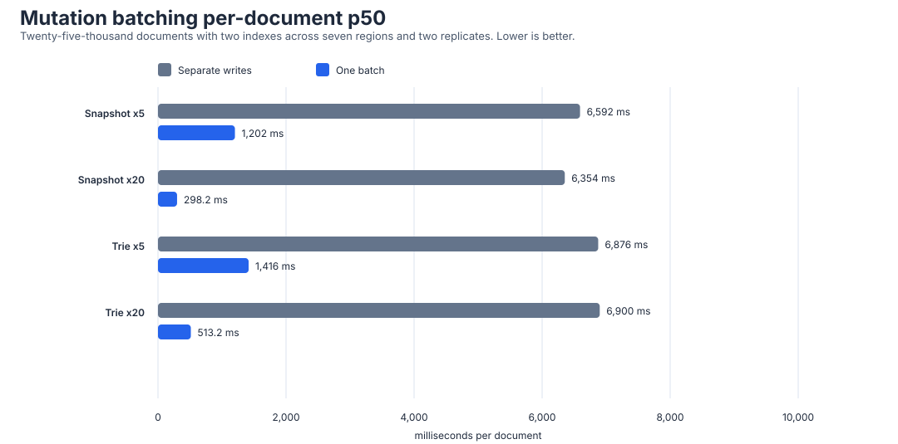

# Browser mutation-batching experiment

Date: 28 September 2026

Branch: `experiment/browser-mutation-batching-current`

Production source commit:

```text
2201d9dd0f1fb17783a129532fa3d440db7f1400
```

Regional caller and Worker harness commit:

```text
6d752ae42d14451afb289137e05194b797b62083
```

## Decision

Authoritative mutation batching passed the regional acceptance criteria.

For the 25,000-document, two-index profile:

- batch size 5 reduced per-document p50 by 81.77 percent for Snapshot and
  79.41 percent for Trie
- batch size 20 reduced per-document p50 by 95.31 percent for Snapshot and
  92.56 percent for Trie
- every batch published one HEAD revision
- all 252 batch groups succeeded
- all 252 batch groups passed immediate read-your-writes verification
- batch size 1 remained a neutral control

The useful conclusion is:

> One authoritative commit successfully amortizes the fixed state-load, index,
> immutable-upload, and HEAD-publication cost across a burst of ordinary
> document mutations.

This result is strong enough to continue toward a production-shaped bounded
batch endpoint and browser coordinator. It is not sufficient to merge a
feature yet because contention, coalescing delay, payload limits, and retry
semantics remain untested.

## Regional method

The regional matrix used:

- 25,000 deterministic documents
- two covering secondary indexes
- Snapshot and Trie
- logical mutation groups of 1, 5, and 20 documents
- sequential ordinary HTTP writes as the control
- one `putMany` authority commit as the candidate
- three iterations per case and region
- seven Azure caller regions
- two pristine-bucket replicates
- Node 22.23.2 callers

The caller sent ordinary JSON documents only. The authority recomputed all
storage objects and indexes. It awaited immutable uploads and final
conditional HEAD publication before returning success.

Each timed logical group was followed by an untimed verification request. The
verification loaded every changed document and checked the expected collection
revision.

The run retained:

- 504 logical groups
- 4,368 attempted document mutations
- 252 batch groups
- 252 separate-write control groups

## Regional latency



| Layout | Documents | Strategy | Total p50 | Total p95 | Per-document p50 | Per-document p95 |
| --- | ---: | --- | ---: | ---: | ---: | ---: |
| Snapshot | 1 | Separate | 6,806.44 ms | 9,971.71 ms | 6,806.44 ms | 9,971.71 ms |
| Snapshot | 1 | Batch | 6,015.84 ms | 9,950.26 ms | 6,015.84 ms | 9,950.26 ms |
| Snapshot | 5 | Separate | 32,961.13 ms | 48,168.85 ms | 6,592.23 ms | 9,633.77 ms |
| Snapshot | 5 | Batch | 6,009.37 ms | 9,516.95 ms | 1,201.87 ms | 1,903.39 ms |
| Snapshot | 20 | Separate | 127,081.16 ms | 195,135.49 ms | 6,354.06 ms | 9,756.77 ms |
| Snapshot | 20 | Batch | 5,963.86 ms | 11,431.43 ms | 298.19 ms | 571.57 ms |
| Trie | 1 | Separate | 6,879.51 ms | 9,001.71 ms | 6,879.51 ms | 9,001.71 ms |
| Trie | 1 | Batch | 6,733.32 ms | 8,325.10 ms | 6,733.32 ms | 8,325.10 ms |
| Trie | 5 | Separate | 34,379.64 ms | 43,521.05 ms | 6,875.93 ms | 8,704.21 ms |
| Trie | 5 | Batch | 7,078.88 ms | 9,078.19 ms | 1,415.78 ms | 1,815.64 ms |
| Trie | 20 | Separate | 137,998.64 ms | 186,423.95 ms | 6,899.93 ms | 9,321.20 ms |
| Trie | 20 | Batch | 10,264.63 ms | 13,851.33 ms | 513.23 ms | 692.57 ms |

Batching does not make the complete group instantaneous. Batch size 20 still
took 5.96 seconds p50 for Snapshot and 10.26 seconds p50 for Trie. It makes
bursty multi-document work practical by amortizing that fixed cost.

## Acceptance result

| Layout | Batch size | Per-document p50 change | Per-document p95 change | Accepted |
| --- | ---: | ---: | ---: | --- |
| Snapshot | 1 | -11.62% | -0.22% | Yes |
| Snapshot | 5 | -81.77% | -80.24% | Yes |
| Snapshot | 20 | -95.31% | -94.14% | Yes |
| Trie | 1 | -2.13% | -7.52% | Yes |
| Trie | 5 | -79.41% | -79.14% | Yes |
| Trie | 20 | -92.56% | -92.57% | Yes |

Batch size 5 exceeded the 50 percent target. Batch size 20 exceeded the 75
percent target.

## Object operations and bytes

### Snapshot

Snapshot batching performed four reads and four writes regardless of whether
the logical group contained 1, 5, or 20 documents.

Relative to separate writes:

- batch size 5 reduced reads, writes, read bytes, and write bytes per document
  by 80 percent
- batch size 20 reduced them by 95 percent
- HEAD writes fell from 5 or 20 to 1

### Trie

Trie must still load and replace every changed tree path, so operation counts
do not become constant.

Relative to separate writes:

| Batch size | Reads per document | Writes per document | Read bytes per document | Write bytes per document |
| ---: | ---: | ---: | ---: | ---: |
| 5 | -63.34% | -57.78% | -79.82% | -79.65% |
| 20 | -77.09% | -71.12% | -94.80% | -94.60% |

HEAD writes still fell from 5 or 20 to 1. Each pair of secondary indexes was
replaced once per batch rather than once per document.

## Reliability and visibility

| Strategy | Successful groups | Total groups | Read-your-writes failures |
| --- | ---: | ---: | ---: |
| Batch | 252 | 252 | 0 |
| Separate writes | 250 | 252 | 2 |

The separate-write failures were:

- one Snapshot group in Brazil South where one of 20 writes returned R2
  internal error `10001`
- one Trie group in North Europe where one of 20 caller requests failed at the
  transport layer

Both groups exposed the expected partial result: 19 documents and 19 HEAD
revisions were committed. Later groups verified successfully because the
corrected harness advanced from the observed revision.

No batch group failed. This does not establish a lower intrinsic batch failure
rate from 252 samples, but it demonstrates the smaller request and publication
surface.

All successful groups recorded zero CAS retries.

## Regional consistency

Every region met the batch size 5 and batch size 20 p50 acceptance targets.

| Layout | Batch size | Smallest regional p50 reduction | Largest regional p50 reduction |
| --- | ---: | ---: | ---: |
| Snapshot | 5 | 77.03% | 81.53% |
| Snapshot | 20 | 94.33% | 95.23% |
| Trie | 5 | 77.63% | 80.52% |
| Trie | 20 | 91.58% | 93.00% |

The result was not dependent on one caller region.

## Broad local matrix

The local preflight covered all 54 comparisons across:

- 128, 5,000, and 25,000 documents
- zero, one, and two indexes
- Snapshot and Trie
- batch sizes 1, 5, and 20

Fifty-one comparisons met the predefined thresholds. Three no-index Trie
cases missed the aggressive target:

| Case | Per-document p50 change | Target |
| --- | ---: | ---: |
| Medium no-index Trie, batch 20 | -67.04% | -75% |
| Large no-index Trie, batch 5 | -35.62% | -50% |
| Large no-index Trie, batch 20 | -53.31% | -75% |

Without global index pages, a multi-document Trie batch still reads and writes
multiple leaf and branch paths. Batching remains beneficial, but the gain is
smaller. This is a real boundary and should be included in product guidance.

For the regional large two-index target, the local result was:

| Layout | Batch size | Per-document p50 change |
| --- | ---: | ---: |
| Snapshot | 5 | -80.07% |
| Snapshot | 20 | -95.05% |
| Trie | 5 | -80.40% |
| Trie | 20 | -94.98% |

## Production-design requirements

The experiment supports a production design with these constraints:

1. The browser sends ordinary validated mutations, never database objects.
2. The endpoint has explicit document-count and decoded-request-byte limits.
3. Success is returned only after immutable uploads and final HEAD CAS.
4. One conflict retries or rejects the complete batch, never a hidden subset.
5. The browser exposes pending, committed, and failed batch states.
6. A short coalescing window is measured separately from storage latency.
7. Batch size 1 remains a supported immediate-write fallback.
8. Contention testing is required before production promotion.

The endpoint should start with a maximum of 20 documents because that is the
largest tested group. A byte limit still needs evidence from representative
application payloads.

## Remaining risks

- A larger batch increases the conflict and retry unit.
- Batch size 20 can hold a request open for 6 to 14 seconds at p50/p95.
- The experiment did not include concurrent writers.
- The experiment did not include an application coalescing delay.
- Large request bodies, authority memory, and provider request limits were not
  varied.
- No offline queue or retry UX was tested.
- No public browser or authority API was implemented.

## Recommendation

Continue to a production-shaped bounded batch endpoint and browser
coordinator on a new branch. Before merging:

1. define request and response contracts
2. enforce document-count and decoded-byte bounds
3. add atomic failure and CAS-conflict tests
4. test concurrent batches against one collection HEAD
5. measure a short browser coalescing window
6. preserve immediate single-write fallback

Verified warm-client Trie context remains a later optimization. Batching has
the broader measured benefit and does not require trusting client-generated
storage structures.

## Raw evidence

Regional evidence:

```text
evidence/mutation-batching-regional-worker-2026-09-28.json
SHA-256 D7BC665AF4080C73EBA56B7A74AF88DA19DA4B9C502EC3D6F9375FEAA5933C0A
```

Local evidence:

```text
evidence/mutation-batching-local-2026-09-28.json
SHA-256 EFCAC2BDB2C380D7C0942DCDD7DD73029E67DEFFDF866070B810B78A57376A4B
```

Comparison CSV:

```text
evidence/mutation-batching-comparison-2026-09-28.csv
SHA-256 8CF8E6B0CE2D0224A8C35237950985DBE374AF25939B799712DAA0D00242B3BF
```

The temporary Worker, R2 buckets, Azure resource group, local benchmark token,
fixtures, and caller containers were deleted after evidence capture. No
production resource was changed.
