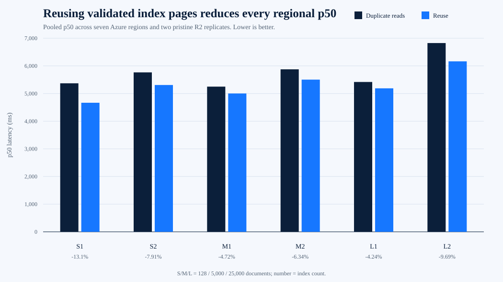

# Trie index-page reuse benchmark

Date: 29 September 2026

Branch: `perf/reuse-trie-index-pages`

Production candidate:

```text
bd8af6eec98b8f4a745d90327e96534c4a09fac0
```

Regional harness:

```text
a1a1d02d9ce71318956e5a5cb9574eed43314c04
```

## Decision

Promote the production candidate to `main`.

The candidate reuses each secondary-index page already loaded during
fail-closed configuration validation instead of reading it again during
update preparation.

The regional matrix did not meet the predeclared 10-percent p50 target in
every medium and large case. Pooled p50 improved by 4.24 to 13.10 percent,
with the largest two-index case improving by 9.69 percent. The narrower
latency gate therefore failed.

The change is still worth promoting because:

- every one-index write removes one remote read
- every two-index write removes two remote reads
- indexed read bytes fall by 35.22 to 49.84 percent
- all six regional p50 values improved
- five of six regional p95 values improved; the remaining p95 changed by
  +0.71 percent
- all 672 writes succeeded
- all 84 post-run protocol comparisons passed
- local decoded keys and bytes were identical
- the worst local p50 change was +1.91 percent, inside the 5-percent CPU
  rejection limit
- there is no API, request, trust, storage-format, or migration change

This is a deterministic removal of redundant work with a modest but consistent
regional latency benefit.

## Implementation

`requireIndexConfiguration()` now returns the decoded active index pages after
checking:

- the configured and active index counts match
- every active index remains configured
- every referenced index object exists
- every stored index definition matches the supplied definition

`prepareIndexes()` consumes those exact validated pages. It does not fetch the
same objects again.

Validation still finishes before candidate immutable objects are written.
Missing, partial, or mismatched index configuration still fails closed.

## Method

The paired regional matrix covered:

- the production Trie engine
- 128, 5,000, and 25,000 documents
- one and two covering secondary indexes
- four iterations per case and region
- seven Azure caller regions
- two pristine R2 bucket replicates
- 672 measured writes

The control used the same candidate engine and wrapped the object store to
duplicate each index-page `get`. This reproduced the old operation count in
the same Worker deployment and time window without maintaining a second
engine implementation.

Every region, profile, index set, and mode used an isolated prefix.
Authentication and browser rendering were excluded.

The local matrix ran eight updates per case and compared decoded object keys
and bytes after every control/candidate pair.

All temporary Workers, R2 buckets, Azure container groups, and the resource
group were deleted.

## Regional latency



| Documents | Indexes | Duplicate-read p50 | Reuse p50 | p50 change | Duplicate-read p95 | Reuse p95 | p95 change |
| ---: | ---: | ---: | ---: | ---: | ---: | ---: | ---: |
| 128 | 1 | 5,370.46 ms | 4,666.81 ms | -13.10% | 8,739.04 ms | 8,670.09 ms | -0.79% |
| 128 | 2 | 5,765.41 ms | 5,309.08 ms | -7.91% | 9,581.24 ms | 8,998.60 ms | -6.08% |
| 5,000 | 1 | 5,250.03 ms | 5,002.49 ms | -4.72% | 8,497.84 ms | 8,558.28 ms | +0.71% |
| 5,000 | 2 | 5,875.73 ms | 5,503.14 ms | -6.34% | 9,702.23 ms | 8,980.71 ms | -7.44% |
| 25,000 | 1 | 5,418.36 ms | 5,188.63 ms | -4.24% | 9,505.72 ms | 8,956.49 ms | -5.78% |
| 25,000 | 2 | 6,825.80 ms | 6,164.57 ms | -9.69% | 11,467.73 ms | 10,657.09 ms | -7.07% |

## Remote-read reduction

| Indexes | Previous reads | Candidate reads | Read-count change |
| ---: | ---: | ---: | ---: |
| 1 | 6 | 5 | -16.67% |
| 2 | 8 | 6 | -25.00% |

Read-byte reduction increased with collection size because index pages grew
while the unchanged HEAD and Trie-path reads remained small.

| Documents | Indexes | Read-byte change |
| ---: | ---: | ---: |
| 128 | 1 | -35.22% |
| 128 | 2 | -41.57% |
| 5,000 | 1 | -49.00% |
| 5,000 | 2 | -49.53% |
| 25,000 | 1 | -49.65% |
| 25,000 | 2 | -49.84% |

## Reliability and equivalence

| Result | Count |
| --- | ---: |
| Successful writes | 672 |
| Failed writes | 0 |
| CAS retries | 0 |
| Precondition failures | 0 |
| Post-run protocol comparisons | 84 |
| Failed protocol comparisons | 0 |

Local protocol-equivalence tests also compare every stored key and decoded
byte. Partial index configurations fail before any candidate write.

## Local result

The local result isolated decoding, validation, index update, encryption, and
compression cost without network latency.

| Case | Duplicate-read p50 | Reuse p50 | p50 change | Read-byte change |
| --- | ---: | ---: | ---: | ---: |
| Small, 1 index | 2.99 ms | 2.21 ms | -26.22% | -34.97% |
| Small, 2 indexes | 3.52 ms | 2.88 ms | -18.12% | -41.40% |
| Medium, 1 index | 26.07 ms | 23.42 ms | -10.16% | -48.99% |
| Medium, 2 indexes | 56.84 ms | 52.83 ms | -7.06% | -49.53% |
| Large, 1 index | 139.26 ms | 129.26 ms | -7.18% | -49.65% |
| Large, 2 indexes | 308.51 ms | 314.39 ms | +1.91% | -49.84% |

## Acceptance result

| Gate | Result |
| --- | --- |
| Every write succeeds | Pass |
| Final active protocol state is equivalent | Pass |
| Exactly one read removed per index | Pass |
| Every medium and large p50 improves by at least 10% | Fail |
| No p95 regresses by more than 10% | Pass |
| No local indexed p50 regresses by more than 5% | Pass |

The missed latency threshold is retained rather than redefined. Promotion is
based on the deterministic operation and byte reduction, complete
equivalence, low implementation risk, and absence of a material regression.

## Raw evidence

Regional:

```text
evidence/trie-index-page-reuse-regional-worker-2026-09-30.json
SHA-256 DC263801D5BF1C1F9CB563788F566D1A29D22DBAEEF32DDC735E20CF23CFC76F
```

Local:

```text
evidence/trie-index-page-reuse-local-2026-09-30.json
SHA-256 EED29BF6C7C547D2FAB121E024D5F6AC4FE415B3036A690C45F182E9935AC246
```

Summary CSV:

```text
evidence/trie-index-page-reuse-summary-2026-09-30.csv
SHA-256 0ABD1C8229F952BE5E66C78E639FAA4188049B8CCF228373D26EC326D5F1123E
```

Graph:

```text
benchmarks/trie-index-page-reuse/trie-index-page-reuse-p50.svg
SHA-256 69EDA99ECB628C0C7F24028B9A689AA9F28BA22CFD629CCCBDDDFF1CF61D0AA0
```

The evidence contains no credentials.
