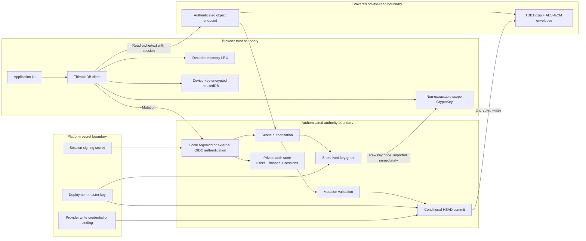
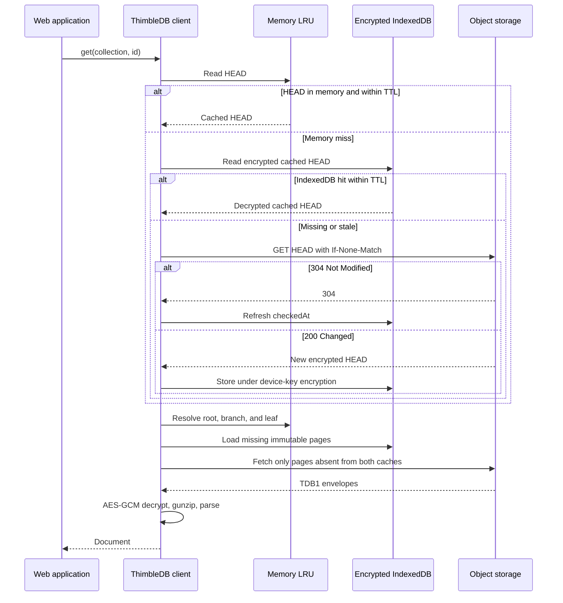
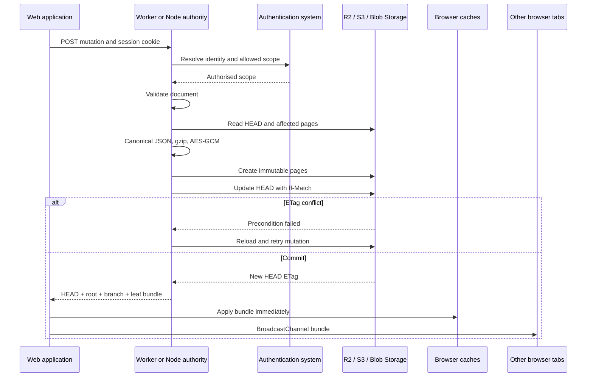
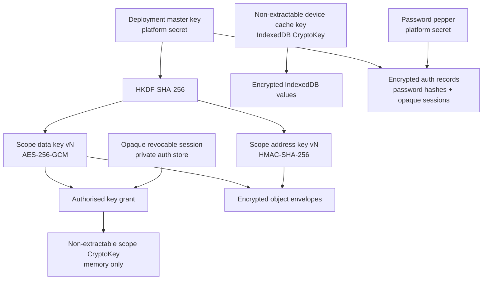
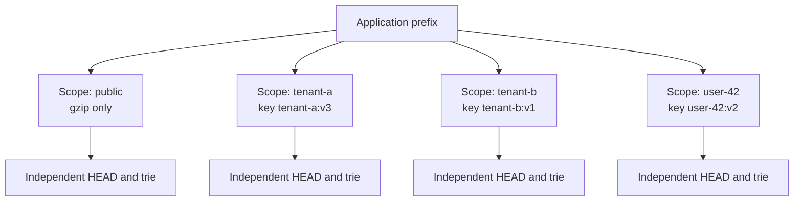
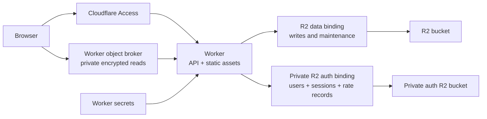
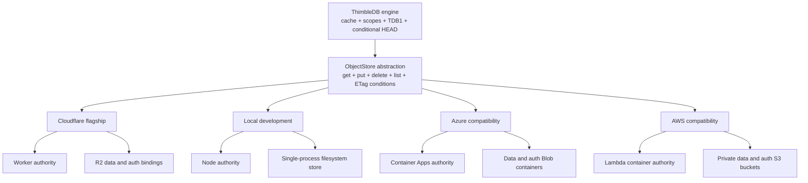

# System diagrams

These diagrams use Mermaid and render directly in GitHub.

## Trust boundaries

Reads require both a current session grant and the relevant scope key.

## Read sequence

## Write sequence

## Key hierarchy and lifetime

The scope key and browser device key have different purposes. The scope key
protects provider storage. The device key protects persistent browser cache
entries.

## Access-scope boundary

Pages from different scopes are never combined. Granting one key therefore
does not expose records from another scope.

## Cloudflare reference deployment

Cloudflare is the reference implementation because the Worker and R2 bindings
remove server management while keeping all reads behind scope authorisation.

## Provider boundary comparison

Only provider credentials, bindings, and read-authorisation mechanisms change.
The object and encryption protocol stays the same.
