# System diagrams

These Mermaid diagrams describe the ThimbleDB 2.1 data, identity, query,
index, migration, and deployment paths.

## Trust boundaries

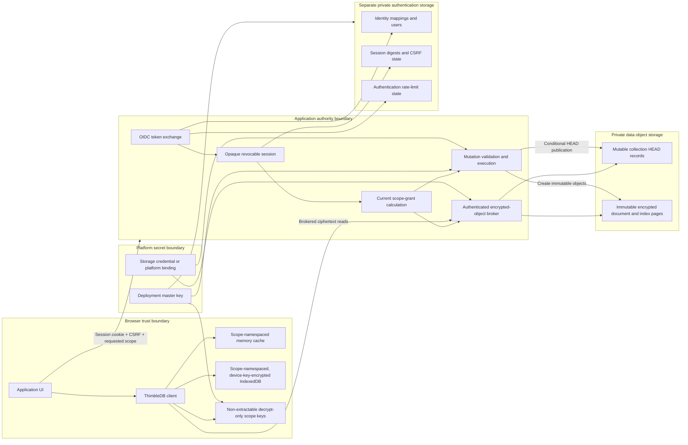

The browser receives decrypt-only scope keys. It never receives a storage
credential, an authority write key, or a database-wide administrator key.

## Connection and key-grant sequence

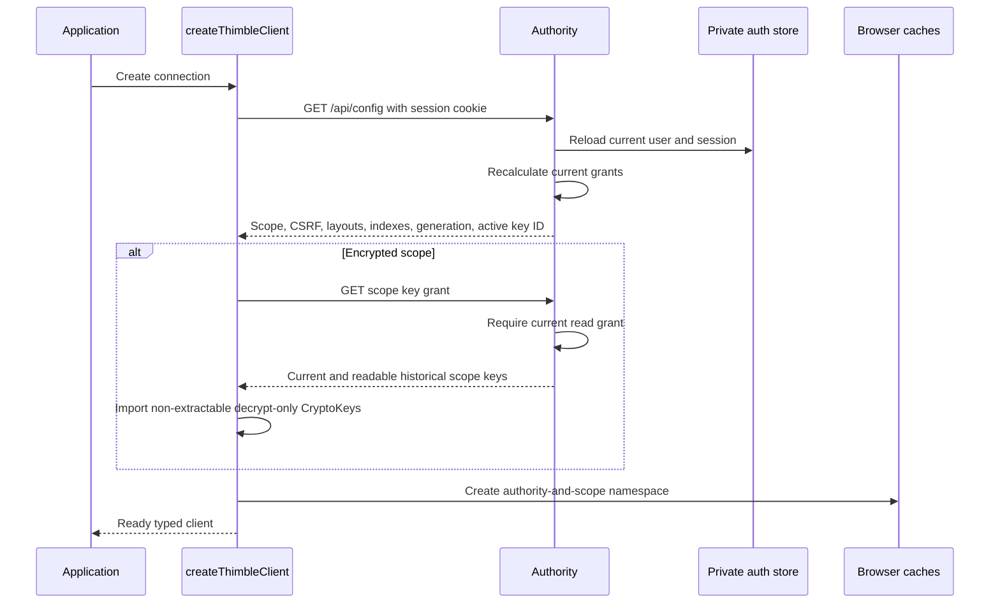

Custom cache implementations receive the same authority-and-scope namespace
as the built-in caches. Reusing one cache object cannot expose another scope.

## Point read and bounded query planning

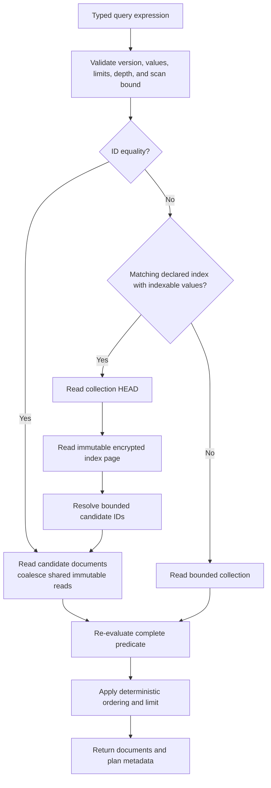

Arrays and objects are not secondary-index values. Queries using those values
fall back to a bounded scan instead of returning an empty indexed result.

## Indexed query read sequence

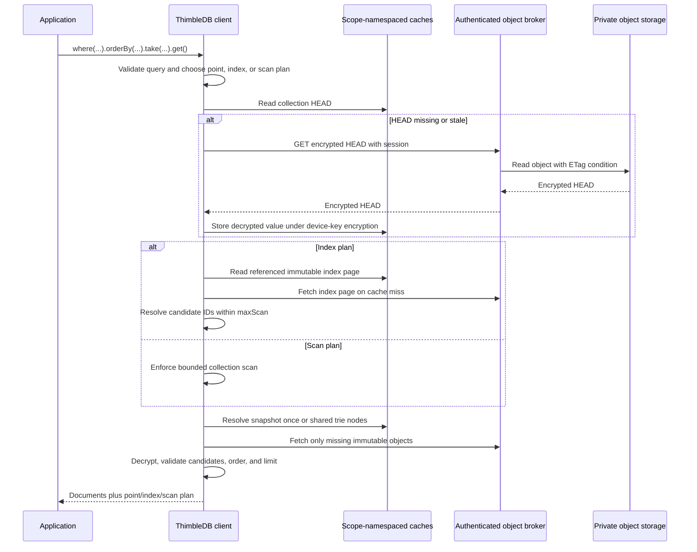

## Atomic document and index write

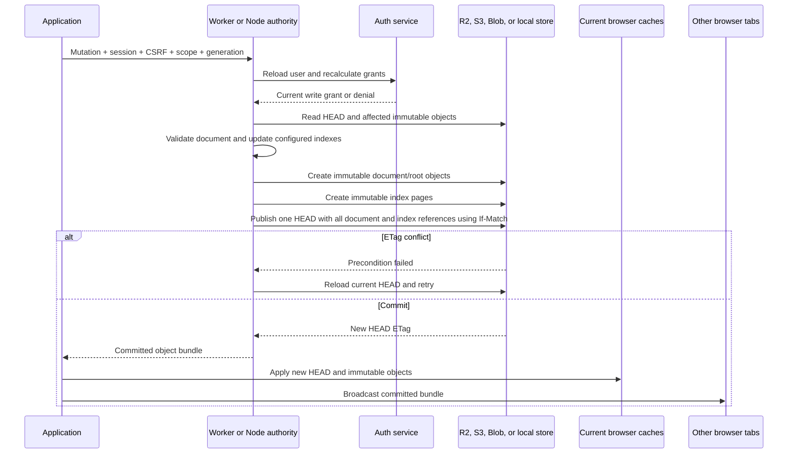

Document roots and secondary indexes become visible through the same
conditional HEAD write. A process that sees existing index references but has
no matching index configuration refuses to rewrite the collection.

## Key hierarchy, rotation, and browser lifetime

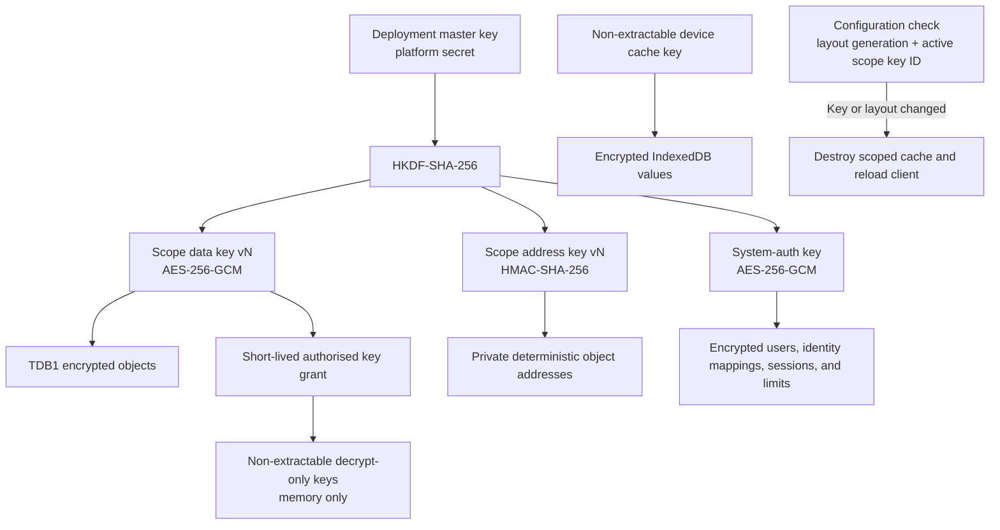

A new connection receives the active key and configured readable historical
keys. An existing connection reloads when the active scope key ID changes.

## Scope-grant boundary

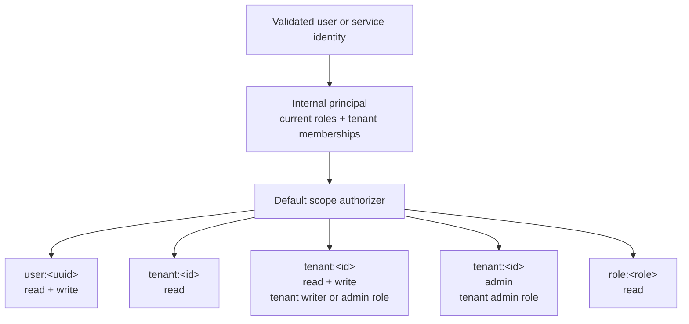

`thimble.admin` authorizes identity-administration endpoints. It does not
implicitly grant access to every data scope.

## Human and service authentication

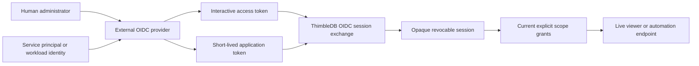

Machine access uses provider-managed application roles and short-lived OIDC
tokens. ThimbleDB does not use a static global admin key.

## Logical migration boundary

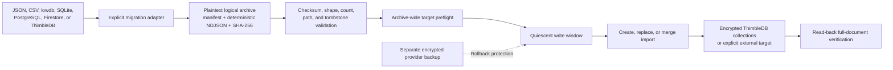

Logical archives are portable plaintext exports, not provider backups.
Cross-collection imports are preflighted before the first write but are not
one distributed transaction.

## Local scaffold and production transition

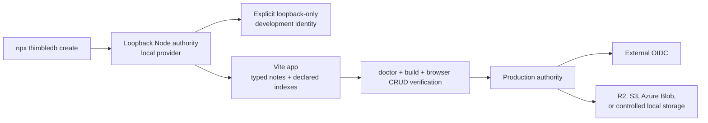

The development identity is unavailable in the Cloudflare authority and the
Node authority refuses it outside local, loopback, non-production settings.

## Cloudflare reference deployment

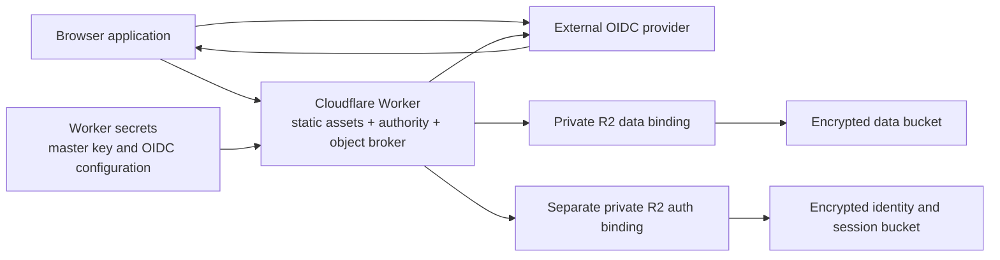

The Worker brokers private reads and performs every write. R2 credentials and
scope encryption material are not exposed to browser code.

## Provider boundary comparison

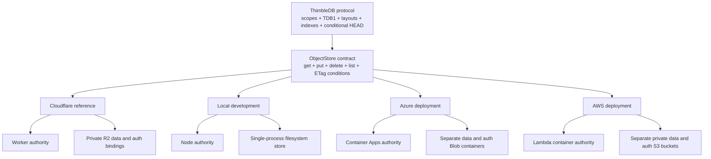

Provider credentials, deployment primitives, and bindings differ. The stored
envelope, scope, query-index, deletion, and conditional-publication protocols
remain the same.
